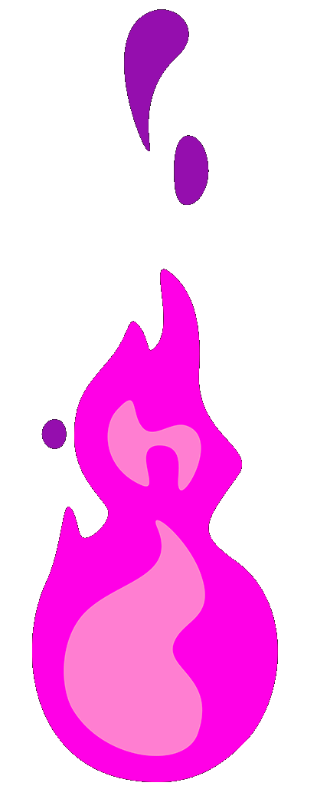

<h3 align="center"> 
    
  </h3>

<strong>Technical Lead & Web Developer</strong> | Madagascar 🇲🇬

  
  
  
  
  

 

##  🚀 À propos de moi
> Technical Lead passionné avec une expertise solide en développement web fullstack et une affinité pour les solutions efficaces. Combinant créativité technique et leadership pour transformer des concepts en produits robustes.

- 🏢 **Technical Lead** chez [**Osmosis Business Solution**](https://osmosis-solution.mg/)
- 🎓 Master 1 en Informatique (CNTEMAD)
- 💡 Passionné par les technologies web, les jeux vidéo et les motos!
- 🌍 **Langues**: Malagasy (natif), Français (professionnel), Anglais (intermédiaire)

##  💻 Stack Technique

### Frontend

### Backend

### Bases de données

### Mobile

### Outils

##  🏆 Trophées

    

##  🛠️ Expérience Professionnelle

###  Technical Lead | Osmosis Business Solution
*Juillet 2024 - Présent*

- ✅ Analyse des besoins clients et traduction technique
- ✅ Planification de projets et gestion de tâches
- ✅ Revues de code et mentorat d'équipe
- ✅ Support technique et résolution de problèmes

###  Web Developer | Osmosis Business Solution
*Novembre 2022 - Juin 2024*

- ✅ Module de calcul de paie utilisant Omnis Studio & PostgreSQL
- ✅ Utilitaires Node.js (export Excel, compression de fichiers, conversion d'images)
- ✅ Modules de gestion des contrats, présences, congés et facturation
- ✅ Module CRM (Customer Relationship Management)
- ✅ Contribution au développement de Stalion RH (solution de gestion RH)
- ✅ Plateforme My-Inscription pour l'Université du Gabon

##  📚 Formation

| Diplôme | Institution | Période |
|---------|-------------|---------|
| Master 1 Informatique | CNTEMAD | 2024 |
| Licence Informatique | Université E-media | 2019-2021 |
| BAC Série C | Lycée Stella Maris | 2018 |

##  📊 Statistiques GitHub

  
  
  

##  🤝 Connectons-nous !

  

  
  💼 Ouvert aux opportunités de collaboration et aux projets intéressants
  

